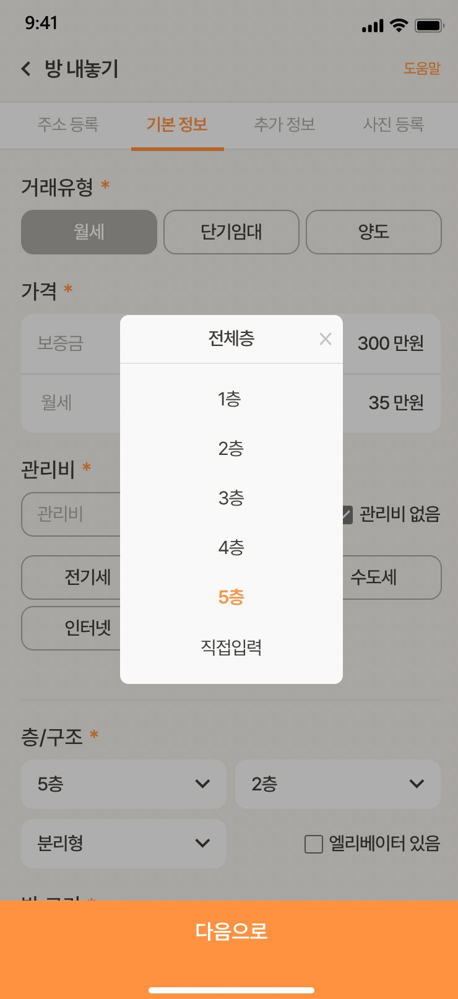
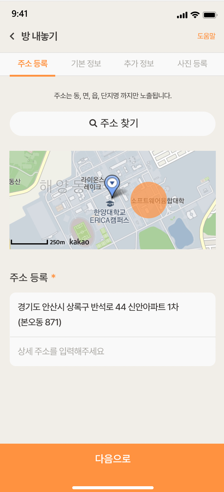
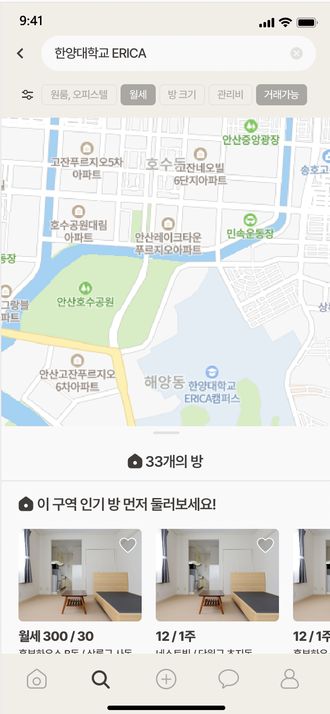
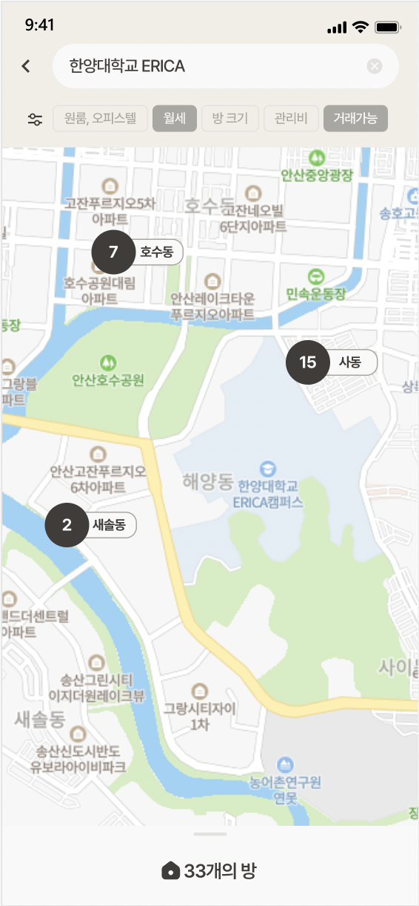
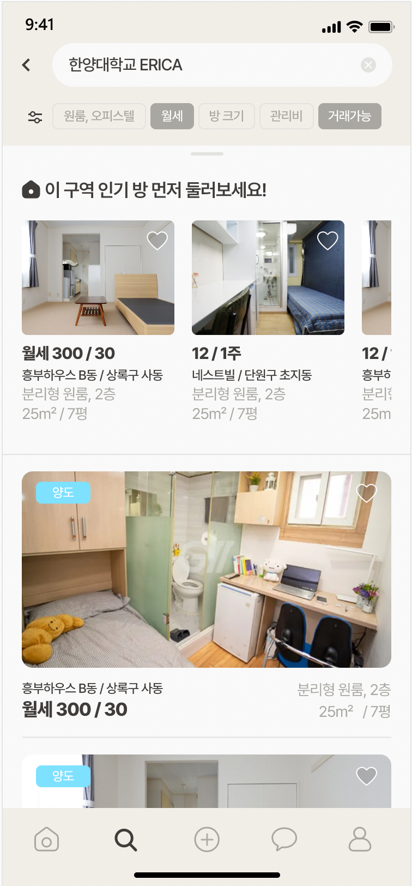
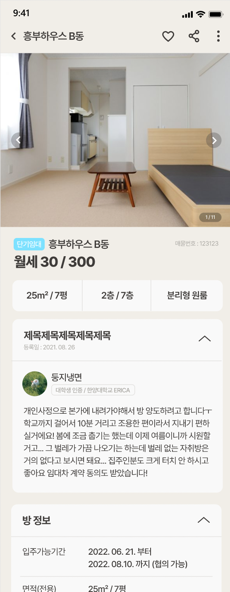

## 📎 우리들의 방구하기 프로젝트 "둥지"

## 🎨 [둥지 디자인 바로가기](https://xd.adobe.com/view/ca0b3f0b-c2a4-44ea-8509-8d23bc654afe-9f58/grid)

둥지 디자인 방향성 : [둥지_디자인 방향성.pdf](https://github.com/Nestsoft-Team/DunJi-FrontEnd/files/9149745/_.pdf)


<br>

## 📍 프로젝트 소개

사업계획서 : [사업계획서v.12.docx](https://github.com/Nestsoft-Team/DunJi-FrontEnd/files/9128153/v.12.docx)

notion : https://spotted-tub-9bb.notion.site/cdb6858907254263886ca183866d811a

<br>

> ### 부동산 단기임대 / 양도양수 전문 플랫폼 <br>

현재 이뤄지는 단기 양도의 경우, 주로 ‘에브리타임’이라는 커뮤니티 앱을 통하여 개인과 개인이 거래를 하기 때문에 정보 부족으로 인해 신뢰성이 떨어집니다.

-   단기적 양도서비스가 필요한 이용자들의 필요를 충족시켜주면서 이용자들의 편의를 제공합니다.
-   청년들을 위한 ‘단기주택’라는 새로운 주거형태가 생겨 주거로 인한 문제를 일시적으로 해결 가능합니다.
-   여러 부가서비스를 통해 임대를 하거나 임대를 받을 때 생기는 여러 불편함을 최소화시켜주어 거래가 보다 더 활발하게 이루어질 것입니다.

위에 첨부된 사업계획서 및 노션 참고
    </br>

<br>

## 🏆 수상내역
- SW창업아이디어톤 입상
- SW창업메이커톤 입상
- SW/ICT 학술대회 최우수상
- SID-Audition 본선 진출
- SW융합연구개발 과제 선정 (1000만원 지원)
- Knowledge Dorm (엑셀레이터 창업 컨설팅) 활동
- 한양벤처창업클럽 가입
- 한양벤처창업클럽 마케팅지원 프로그램 참여
- 한양대학교 ERICA 제5공학관 SW창업1실 입주

<br>

## ⏳ 작업 기간 (2022. 02 ~ )

<br>

## ✨ 팀 소개

|    대표    |   정재현   |
| ----------------- | ------ |
| 프론트엔드 개발자 | 민준경 |
| 백엔드 개발자 | 강예원 |

<br>

## 💻 Front 기술 스택

| 역할        | 스택명                                                                                                                                                                                                           |
| ----------- | ---------------------------------------------------------------------------------------------------------------------------------------------------------------------------------------------------------------- |
| 프레임워크  |                                                                                                              |
| styling     |                                                                                                     |
| 상태관리    |                                                                                                         |
| 기본 언어   |                                                                                          |
| 버전 컨트롤 |   |

<br>

## 🧑🏻‍💻 역할

| 작업자 | 작업 내용                                                                                                                                                                                                                                                                            |
| ------ | ------------------------------------------------------------------------------------------------------------------------------------------------------------------------------------------------------------------------------------------------------------------------------------ |
| 민준경 | - 방 등록 페이지 구현 <br> - 재사용 가능한 컴포넌트 구현<br> - 지도 페이지와 지도 위 매물 구현 <br> - redux 상태 관리 제어 <br> - 검색 페이지 구현 <br> - 지도 하단 클릭 드래그에 따른 방 리스트 컴포넌트 이동 구현 <br> - 매물 검색 필터 페이지 구현<br> - 방 상세 정보 페이지 구현 |
|        |

<br>

## 🌟 `둥지` 주요 기능 소개

### `로그인`

로그인 기능은 소셜로그인을 지원합니다

-   카카오로 로그인

### `매물 등록`

방에 대한 정보와 사진 및 위치 정보를 입력합니다.

-   방 종류
-   거래 유형
-   옵션 정보
-   사진
-   주소

등 을 기입할 수 있습니다.




### `지도`

매물을 지도상에 마커 컴포넌트로 표현합니다.

클릭 시 방 정보 상세 페이지로 이동합니다.

상단의 검색 기능을 통해 주소를 특정지어 지도 중심을 이동하고 렌더링되는 마커를 필터를 통해 분별합니다.

하단에 드래그 앤 드롭으로 구현되는 컴포넌트를 통해 대략적인 정보를 얻을 수 있습니다.





### `상세 정보`

매물에 대한 상세 정보와 사진을 carousel로 구현했습니다.



# 폴더 구조

```bash
|____README.md
|____styles
| |____FontAwesome.tsx
| |____globals.css
|____components
| |____room-register
| | |____extraComponents // 상세정보 페이지 구성 컴포넌트
| | |____PhotoComponents // 상세정보 페이지 구성 컴포넌트
| | |____basicComponents // 상세정보 페이지 구성 컴포넌트
| |____layout
| | |____index.tsx // 상세정보 페이지 구성 컴포넌트
| | |____Nav.tsx // 상세정보 페이지 구성 컴포넌트
| |____common // 상세정보 페이지 구성 컴포넌트
| |____map // 상세정보 페이지 구성 컴포넌트
| |____daum-postcode // 지도
| |____filter // 상세정보 페이지 구성 컴포넌트
| |____room-detail // 상세정보 페이지 구성 컴포넌트
|____assets
| |____icon
| | |____logo
| |____fonts
|____pages
| |____index.tsx // 메인 페이지
| |____room
| | |____register
| | | |____index.tsx // 방 등록
| | |____[id].tsx // 방 상세정보
| |____oauth
| | |____kakao
| | | |____callback
| | | | |____index.tsx
| |____login.tsx
| |_____document.tsx // resize에 따른 화면 크기 조정 로직
| |____register
| | |____policy.tsx
| | |____form.tsx
| |____map
| | |____index.tsx // 메인 지도화면
| | |____filter.tsx // 지도 검색 필터
| |_____app.tsx
|____.eslintrc.json
|____store // redux
| |____index.tsx
| |____modules
| | |____index.tsx
| | |____roomRegister.tsx // 방 등록 관련 정보
|____hooks
| |____useRoomRegisterRedux.tsx
| |____useDuplicateSelect.tsx
| |____useNoDuplicateSelect.tsx
```
